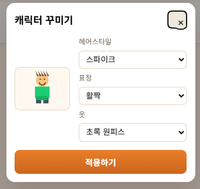
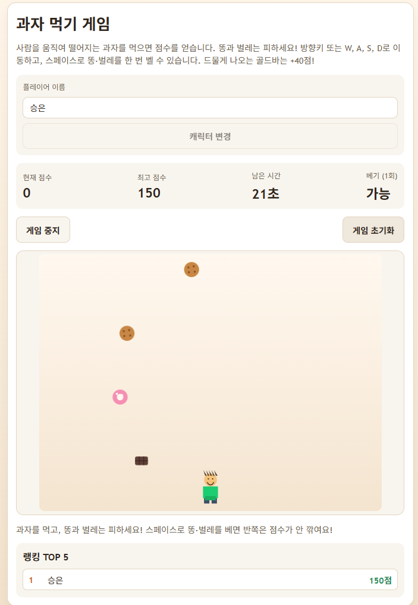

# 과자 먹기 게임

과자를 먹으며 점수를 올리는 간단한 게임입니다.
플레이어는 사람 캐릭터를 움직여 떨어지는 과자와 골드바를 먹고, 똥과 벌레는 피해야 합니다.

URL: https://snack-game-black.vercel.app/


## 게임 방법

- 이름을 입력한 뒤 `게임 시작` 버튼을 누르거나 스페이스 키를 누르면 게임이 시작됩니다.
- 방향키 또는 `W`, `A`, `S`, `D`로 캐릭터를 움직입니다.
- 과자를 먹으면 점수가 올라갑니다.
- 골드바를 먹으면 큰 점수를 얻습니다.
- 똥과 벌레를 먹으면 점수가 깎입니다.
- 스페이스 키로 한 번만 똥이나 벌레를 벨 수 있습니다.
- 제한 시간이 끝나면 최종 점수가 표시됩니다.

## 점수 규칙

점수 값은 [js/config.js](js/config.js)에 모여 있습니다.

| 아이템 | 점수 |
| --- | ---: |
| 과자 | +10 |
| 골드바 | +40 |
| 똥 | -15 |
| 벌레 | -10 |

점수는 0점 아래로 내려가지 않습니다.

## 최고 점수와 랭킹

- 개인 최고 점수는 브라우저의 `localStorage`에 저장됩니다.
- 이름별 랭킹도 `localStorage`에 저장됩니다.
- 같은 이름으로 다시 플레이했을 때 이전 랭킹 점수보다 높으면 갱신됩니다.
- 최고 점수를 넘기지 못하면 캐릭터가 한 번 펄쩍 뛰고 좌절한 표정이 됩니다.

## 캐릭터 커스터마이징

게임 시작 전 `캐릭터 변경` 버튼으로 캐릭터를 꾸밀 수 있습니다.

- 머리 모양
- 표정
- 옷 색상

선택한 캐릭터 정보도 브라우저에 저장되어 다음에 다시 접속해도 유지됩니다.

## 파일 구조

```text
snack-game/
├─ index.html          화면 구조
├─ server.js           로컬 실행용 정적 서버
├─ css/
│  └─ style.css        화면 스타일
├─ js/
│  ├─ main.js          게임 시작 준비와 이벤트 연결
│  ├─ game.js          게임 루프, 시작/정지/종료 흐름
│  ├─ state.js         점수, 시간, 게임 상태 저장
│  ├─ player.js        플레이어 이동과 캐릭터 애니메이션
│  ├─ character.js     캐릭터 그리기와 꾸미기
│  ├─ items.js         떨어지는 아이템 생성/이동/그리기
│  ├─ collision.js     플레이어와 아이템 충돌 검사
│  ├─ ui.js            점수판, 메시지, 게임 오버 화면 표시
│  ├─ ranking.js       이름과 랭킹 저장
│  └─ config.js        게임 설정값 모음
└─ images/             아이템 이미지
```

## 코드 흐름 쉽게 보기

### 1. 처음 페이지가 열릴 때

[js/main.js](js/main.js)의 `init()` 함수가 실행됩니다.

이 함수는 다음 일을 합니다.

- HTML 요소를 찾아서 JavaScript와 연결합니다.
- 키보드 입력을 등록합니다.
- 저장된 최고 점수, 이름, 캐릭터 정보를 불러옵니다.
- 아이템 이미지를 불러옵니다.
- 처음 화면의 점수판과 랭킹을 그립니다.

### 2. 게임이 시작될 때

`startGame()` 함수가 실행됩니다.

이 함수는 다음 일을 합니다.

- 이름이 입력되어 있는지 확인합니다.
- 이전 게임 오버 화면을 숨깁니다.
- 점수와 시간을 초기화합니다.
- 캐릭터 위치와 아이템 목록을 초기화합니다.
- `requestAnimationFrame`으로 게임 루프를 시작합니다.

### 3. 게임이 진행되는 동안

[js/game.js](js/game.js)의 `gameLoop()`가 계속 반복됩니다.

한 프레임마다 다음 순서로 움직입니다.

1. 플레이어 위치를 업데이트합니다.
2. 아이템 위치를 업데이트합니다.
3. 플레이어와 아이템이 부딪혔는지 확인합니다.
4. 점수와 남은 시간을 갱신합니다.
5. 캔버스에 배경, 아이템, 플레이어를 다시 그립니다.

### 4. 아이템을 먹었을 때

충돌은 [js/collision.js](js/collision.js)에서 검사합니다.

충돌한 아이템이 있으면 [js/game.js](js/game.js)의 `handleCollisions()`가 점수를 바꿉니다.

- 좋은 아이템이면 점수가 올라갑니다.
- 나쁜 아이템이면 점수가 내려가고 캐릭터가 흔들립니다.
- 반으로 잘린 나쁜 아이템은 먹어도 점수가 깎이지 않습니다.

### 5. 게임이 끝날 때

시간이 0이 되면 `endGame()`이 실행됩니다.

이때 [js/state.js](js/state.js)의 `setGameOver()`가 최종 점수와 최고 점수 갱신 여부를 계산합니다.

- 최고 점수를 넘으면 최고 점수를 저장합니다.
- 최고 점수를 못 넘으면 캐릭터가 먼저 점프하고, 그 다음 좌절 표정이 됩니다.
- 최종 점수와 랭킹 결과가 게임 오버 화면에 표시됩니다.

## 최고 점수 실패 애니메이션 설명

최근 추가된 동작입니다.

관련 파일은 [js/player.js](js/player.js), [js/game.js](js/game.js), [js/character.js](js/character.js), [js/config.js](js/config.js)입니다.

- `game.js`는 게임 종료 후 최고 점수를 넘겼는지 확인합니다.
- 넘기지 못했다면 `triggerPlayerHop()`으로 점프를 시작합니다.
- 점프 중에는 캐릭터 표정이 `surprised`로 바뀝니다.
- 점프가 끝나면 `frustrated` 표정으로 바뀝니다.
- `character.js`는 `frustrated` 표정을 직접 캔버스에 그립니다.
- 점프 시간은 `config.js`의 `FEEDBACK.gameOverHopDuration` 값으로 조절합니다.

## 수정할 때 보기 좋은 곳

- 게임 시간을 바꾸고 싶다면: [js/config.js](js/config.js)의 `GAME_DURATION`
- 점수를 바꾸고 싶다면: [js/config.js](js/config.js)의 `SCORES`
- 캐릭터 속도를 바꾸고 싶다면: [js/config.js](js/config.js)의 `PLAYER_CONFIG.speed`
- 아이템이 떨어지는 속도를 바꾸고 싶다면: [js/config.js](js/config.js)의 `ITEM_CONFIG.fallSpeed`
- 게임 오버 애니메이션 시간을 바꾸고 싶다면: [js/config.js](js/config.js)의 `FEEDBACK.gameOverHopDuration`

## 핵심 개념

- `HTML`은 화면에 어떤 요소가 있는지 정합니다.
- `CSS`는 화면이 어떻게 보일지 정합니다.
- `JavaScript`는 게임이 어떻게 움직일지 정합니다.
- `canvas`는 JavaScript가 그림을 직접 그리는 공간입니다.
- `requestAnimationFrame`은 브라우저가 부드럽게 화면을 다시 그리도록 도와주는 함수입니다.
- `localStorage`는 브라우저에 간단한 데이터를 저장하는 공간입니다.


## 게임 화면

### 캐릭터 변경 화면


### 게임 실행 화면
 

